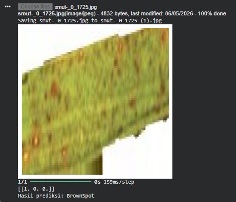

# 🌾 Klasifikasi Penyakit Daun Padi Menggunakan CNN

# 📌 Deskripsi

Proyek ini bertujuan untuk mengklasifikasikan penyakit daun padi menggunakan metode Convolutional Neural Network (CNN). Model dilatih untuk mengenali tiga jenis penyakit daun padi berdasarkan citra digital.

# 🦠 Kelas yang digunakan:

1. Brown Spot
2. Leaf Smut
3. Tungro

# 🎯 Tujuan
1. Membangun model CNN untuk klasifikasi citra daun padi
2. Meningkatkan akurasi deteksi penyakit tanaman
3. Membantu proses identifikasi penyakit secara otomatis

# 🗂️ Struktur Dataset
Dataset disimpan dalam format direktori sebagai berikut:

Dataset/
 │
 ├── brown_spot/
 ├── Leaf smut/
 └── tungro/

# ⚙️ Tahapan Proses

1. Data Preparation
- Mengambil dataset dari Google Drive
- Memisahkan data berdasarkan kelas

2. Preprocessing & Augmentasi
 Menggunakan Image Data Generator:
- Rescale (normalisasi)
- Rotasi
- Flip horizontal
- Shear transformation

3. Data Generator
 Menggunakan:
flow_from_directory()

Untuk:
- Load data otomatis
- Labeling
- Batching

# 🧠 Arsitektur Model CNN
Model terdiri dari:
- Conv2D
- MaxPooling2D
- Flatten
- Dense Layer
- Dropout

 Output layer:
- Dense(3, activation='softmax')

# 🏋️ Training Model

- Optimizer: RMSprop
- Loss Function: categorical_crossentropy
- Epoch: 50
- Validation Split: 20%

 Model terbaik disimpan menggunakan:
- ModelCheckpoint

# 📊 Evaluasi Model
Evaluasi dilakukan dengan:
- Accuracy
- Loss
- Validation Accuracy

 Visualisasi:
- Grafik Accuracy vs Epoch
- Grafik Loss vs Epoch

# 🔬 Visualisasi Feature Map
Menampilkan hasil ekstraksi fitur dari setiap layer CNN untuk memahami bagaimana model bekerja.

# 🧪 Testing / Inference
Model dapat digunakan untuk memprediksi gambar baru:
Output:
- Probabilitas tiap kelas
- Hasil klasifikasi akhir

# 📈 Contoh Hasil
- Hasil prediksi: BrownSpot
   
  
